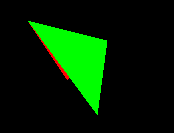
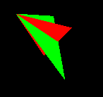

# OBJ-JS-Render

Attempt at writing an in-browser renderer for objects in Wavefront OBJ file format. Mainly a proof-of-concept and is far from complete.

Based on [this](https://www.scratchapixel.com/lessons/3d-basic-rendering/rasterization-practical-implementation) guide to implementing rasterization with code. Makes use of HTML, CSS, and JS.

## Images

The image below is a render of two triangles in 3D space, where the red triangle is hidden behind the green triangle.

  

Here is the render after "pushing" the green triangle's top-right vertex away from the viewer. The top-right portion of the red triangle can now be seen peeking through the green triangle.

  

